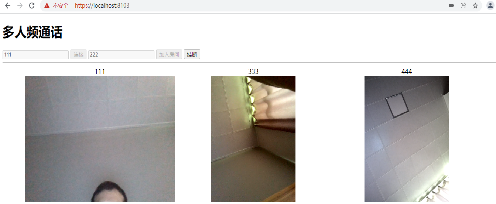

# WebRTC-WS

#### 介绍

使用 JavaScript WebRTC 代码实现跨平台音视频通话，实现1对1视频，多人视频，视频直播，视频会议，房间管理，权限管理等。

#### 使用技术

`NodeJs` `ws` `socket.io` `WebRTC` `WebSocket` `ICE/STUN/TURN`

#### 运行

npm install

（1）示例 zero 使用 socket.io

node ./server/zero.js

（2）示例 one 使用 ws 模块

node ./server/one.js

（3）示例 many 实现多人视频

node ./server/many.js

